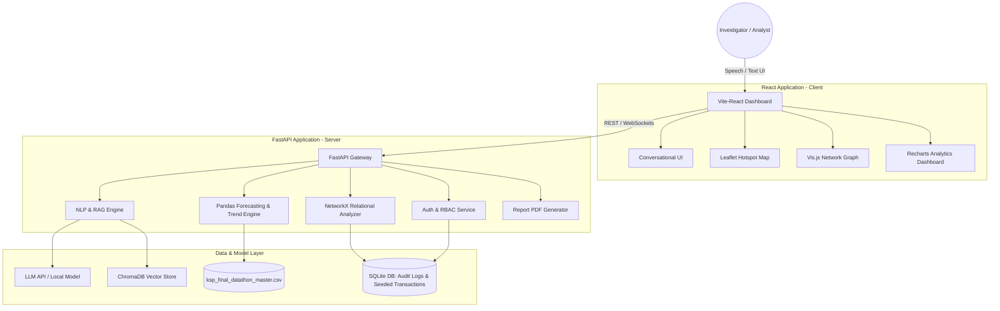

# KSP Intelligent Conversational AI & Crime Analytics Platform

An advanced, criminology-grounded platform designed for law enforcement investigators, analysts, supervisors, and policymakers. This system enables natural language interactions (English/Kannada, voice/text) with the Karnataka State Crime Database, criminal network analysis, geospatial hotspot tracking, offender profiling, financial transaction tracing, and explainable predictive intelligence.

---

## Table of Contents
1. [System Vision & Objectives](#1-system-vision--objectives)
2. [Dataset Overview & Insights](#2-dataset-overview--insights)
3. [System Architecture & Design](#3-system-architecture--design)
4. [Technology Stack](#4-technology-stack)
5. [Core Modules & Logic Design](#5-core-modules--logic-design)
6. [Database Schema & Seed Design](#6-database-schema--seed-design)
7. [Explainable AI & Governance Model](#7-explainable-ai--governance-model)
8. [Phased Implementation Roadmap](#8-phased-implementation-roadmap)
9. [Proposed Directory Structure](#9-proposed-directory-structure)

---

## 1. System Vision & Objectives
The platform empowers law enforcement with a search-to-insight workflow:
- **Democratize Data Access:** Convert complex SQL queries and CSV lookups into simple, multi-lingual natural language questions (e.g., *"How many fraud cases were reported in Mysuru in 2021 where Suresh K. was a suspect?"* / *"ಮೈಸೂರಿನಲ್ಲಿ 2021 ರಲ್ಲಿ ಸುರೇಶ್ ಕೆ. ಆರೋಪಿಯಾಗಿದ್ದ ವಂಚನೆ ಪ್ರಕರಣಗಳು ಎಷ್ಟು?"*).
- **Proactive & Predictive Policing:** Unveil hidden trends, forecast regional crime hotspots, and prioritize investigations using dynamic risk scoring.
- **Relational Intelligence:** Map offender syndicates, trace victim-suspect associations, and overlay transaction networks to identify money trails.

---

## 2. Dataset Overview & Insights
Based on analysis of the `ksp_final_datathon_master.csv` file, the platform operates on:
* **Scope:** 2,500 records spanning **10 years (2014–2023)** across **25 Districts** of Karnataka.
* **Crime Categories:** 10 core crime types (Murder, Rape, Kidnapping, Theft, Robbery, Assault, Burglary, Cybercrime, Dowry Deaths, Fraud).
* **Suspect Profiles:** 1,281 unique suspect profiles mapping to 5 major recurring monikers (*Praveen Shetty, Suresh K., Anand Gowda, Yashwanth M., Manjunath S.*) plus cases under active investigation (*KA-CRM-UNKNOWN*).
* **Syndicates:** 3 major crime networks (*National Highway Syndicate, Coastal Smuggling Crew, Inter-District Cyber Wing*).
* **Geospatial & Temporal Data:** Precise latitude/longitude coordinates, peak incident hours, day profiles (Weekday/Weekend), and time blocks.

---

## 3. System Architecture & Design

The platform uses a decoupled client-server architecture:



### Data Flow Execution Model
1. **Natural Language Query:** User speaks or types a query.
2. **Translation & Parsing:** The NLP engine detects the language (English/Kannada), translates query tokens if necessary, and extracts filters (District, Year, Crime Type, Suspect).
3. **Structured RAG retrieval:**
   - Textual summaries (FIRs) are matched using vector search (ChromaDB).
   - Aggregate numbers are extracted directly from Pandas dataframes to guarantee mathematical accuracy.
4. **Graph Relational Lookup:** Suspect IDs are cross-referenced with the sqlite-seeded transaction network and NetworkX syndicate graphs.
5. **JSON Response & Visualization:** The API returns structured JSON, allowing the React UI to display chat logs, interactive nodes, charts, or maps side-by-side.

---

## 4. Technology Stack

### Frontend (Client-side)
* **Framework:** React 18+ (Vite-based for fast builds and hot module reloading) with TypeScript.
* **Styling:** Custom CSS3 with global design variables, glassmorphic dark mode styling, and responsive grids. (Zero Tailwind configuration to maintain custom aesthetic flexibility).
* **Visualizations:**
  - **Relational Networks:** `vis-react` / `react-force-graph` for criminal-transaction link maps.
  - **Geospatial Hotspots:** `react-leaflet` / Leaflet.js with heatmaps.
  - **Trend Analytics:** `recharts` for smooth, interactive charts.
* **Speech Integration:** Web Speech API (SpeechRecognition and SpeechSynthesis) for native multi-lingual voice commands.

### Backend (Server-side)
* **Framework:** Python 3.9+ with FastAPI (highly performant, auto-generates Swagger API documentation).
* **Data Manipulation:** `pandas` and `numpy` for high-speed dataframe queries and analytical aggregations.
* **Criminology Modeling & Forecasting:** 
  - `statsmodels` (ARIMA/SARIMAX) or `scikit-learn` for crime rate forecasting.
  - `NetworkX` for community detection (Louvain algorithm), centralities (degree, betweenness), and shortest-path analysis.
* **Local Databases:** 
  - `SQLite` (via SQLAlchemy) for role-based users, mock transaction ledgers, audit trails, and saved chat logs.
  - `ChromaDB` (or a lightweight BM25/TF-IDF database) for semantic text matching of FIR descriptions.
* **PDF Export:** `reportlab` or `FPDF2` to export formatted case history PDFs.

---

## 5. Core Modules & Logic Design

### Module 1: Conversational Crime Intelligence Interface
- **Context Management:** FastAPI uses session-based token history to store sliding windows of previous turns. If the user asks: *"List burglaries in Udupi in 2021"*, followed by *"Who were the suspects?"*, the backend injects `District="Udupi"`, `Year=2021`, and `Crime_Type="Burglary"` into the second query context.
- **Bi-lingual Parsing:** 
  - Integrates a semantic matcher or LLM prompt translation layer.
  - Translates Kannada input into schema terms (e.g., 'ಕೊಲೆ' -> Murder, 'ದರೋಡೆ' -> Robbery).
  - Uses localized templates for Kannada voice outputs.
- **RAG Integration:** RAG reads `FIR_Text_Summary_EN` / `FIR_Text_Summary_KN`. Queries are embedded using a sentence-transformer model and queried against ChromaDB to find similar modus operandi.

### Module 2: Criminal Network & Relationship Analysis
- **Entity Linking:** Builds a multi-graph where:
  - **Nodes:** Suspect (ID/Moniker), Syndicate, District (Location), Incident (FIR/Record), Bank Account.
  - **Edges:** Affiliation (Suspect $\rightarrow$ Syndicate), Location of Crime (Suspect $\rightarrow$ District), Involvement (Suspect $\rightarrow$ Incident), Transaction (Account $\rightarrow$ Account).
- **Syndicate Detection:** Uses NetworkX to trace links between different suspect IDs sharing the same moniker or syndicate, showing how they operate across district boundaries.

### Module 3: Crime Pattern & Trend Analytics
- **Hotspot Clustering:** Uses DBSCAN or K-Means clustering on `Latitude` and `Longitude` values to identify hotspots.
- **Geographic Mapping:** Leaflet renders clustered markers. Heatmaps show relative intensity based on `Cases_Reported` and `Risk_Score`.
- **Temporal Analysis:** Visualizes crime spikes by Hour of the Day (0–23), Day Profile (Weekday vs. Weekend), and Season.

### Module 4: Sociological Crime Insights
- **Socio-Economic Correlation:** Intersects crime densities with simulated sociological factors (urbanization levels, migration rates, economic stress, and literacy) based on Karnataka district profiles.
- **Demographic Breakdown:** Charts age distributions and recidivism rates among different syndicates.

### Module 5: Offender Profiling
- **Recidivism Rating:** Calculates an offender risk rating based on:
  $$Risk\_Score = (Recidivism\_Count \times 0.4) + (Syndicate\_Affiliation\_Weight \times 0.3) + (Historical\_Conviction\_Rate \times 0.3)$$
- **Behavioral Profiling:** Summarizes a suspect's preferred *Modus Operandi* (Time Block, Peak Hour, Legal Sections violated).

### Module 6: Investigator Decision Support
- **Case Summarization:** Automatically extracts details from FIR summaries.
- **Similar Case Search:** Matches the target case's `Legal_Sections` and `Incident_Time_Block` against the database using cosine similarity to recommend historical cases.

### Module 7: Financial Crime & Transaction Link Analysis
- Since the CSV does not contain financial data, the backend will **reproducibly synthesize transaction ledgers** linked to the `Suspect_ID` list:
  - Generates mock bank accounts for suspects.
  - Creates transaction records (Timestamp, Amount, Source IBAN, Destination IBAN, Flagged status) with specific anomalies (e.g., rapid transfers, transactions matching crime times).
  - Integrates a visual transaction trail in the UI.

### Module 8: Crime Forecasting & Early Warning
- **Forecasting Model:** Fits an autoregressive time-series model (e.g., ARIMA) on yearly historical data per district to forecast the expected crime rate for the upcoming years (2024–2026).
- **Early Warning System:** Triggers warnings if a district's risk score exceeds an SD threshold (+1.5 $\sigma$) above its 5-year running average.

---

## 6. Database Schema & Seed Design (SQLite)

The backend SQLite database maintains state, audit trails, and mock financial transactions:

```sql
-- Role-Based Access Control
CREATE TABLE users (
    id INTEGER PRIMARY KEY AUTOINCREMENT,
    username TEXT UNIQUE NOT NULL,
    password_hash TEXT NOT NULL,
    role TEXT CHECK(role IN ('Investigator', 'Analyst', 'Supervisor', 'Policymaker')) NOT NULL,
    created_at TIMESTAMP DEFAULT CURRENT_TIMESTAMP
);

-- Audit Logs (Law Enforcement Traceability)
CREATE TABLE audit_logs (
    id INTEGER PRIMARY KEY AUTOINCREMENT,
    user_id INTEGER,
    action TEXT NOT NULL,
    query_text TEXT,
    timestamp TIMESTAMP DEFAULT CURRENT_TIMESTAMP,
    FOREIGN KEY(user_id) REFERENCES users(id)
);

-- Synthesized Financial Accounts
CREATE TABLE bank_accounts (
    account_number TEXT PRIMARY KEY,
    suspect_id TEXT, -- References Suspect_ID in CSV
    suspect_name TEXT NOT NULL,
    bank_name TEXT NOT NULL,
    balance REAL,
    account_status TEXT CHECK(account_status IN ('Active', 'Flagged', 'Frozen')) DEFAULT 'Active'
);

-- Synthesized Transactions
CREATE TABLE transactions (
    transaction_id TEXT PRIMARY KEY,
    sender_account TEXT,
    receiver_account TEXT,
    amount REAL NOT NULL,
    timestamp TIMESTAMP NOT NULL,
    transaction_type TEXT CHECK(transaction_type IN ('Transfer', 'Cash Deposit', 'Wire', 'Hawala suspect')),
    is_suspicious INTEGER CHECK(is_suspicious IN (0, 1)) DEFAULT 0,
    FOREIGN KEY(sender_account) REFERENCES bank_accounts(account_number),
    FOREIGN KEY(receiver_account) REFERENCES bank_accounts(account_number)
);

-- Conversation History (For PDF export)
CREATE TABLE conversations (
    id INTEGER PRIMARY KEY AUTOINCREMENT,
    user_id INTEGER,
    session_id TEXT NOT NULL,
    sender TEXT CHECK(sender IN ('User', 'Agent')) NOT NULL,
    message_text TEXT NOT NULL,
    language TEXT DEFAULT 'EN',
    timestamp TIMESTAMP DEFAULT CURRENT_TIMESTAMP,
    FOREIGN KEY(user_id) REFERENCES users(id)
);
```

---

## 7. Explainable AI & Governance Model
To maintain law enforcement accountability, the platform employs **Explainable Analytics**:
1. **Evidence Trails:** Every statistical chart or query response displays a "Data Source Footnote" showing the exact rows of the CSV used, the mathematical filter applied (e.g., `df.query("District == 'Mysuru' and Year == 2021")`), and the margin of error.
2. **Logic Transparency:** If a suspect is assigned a high risk score, the system displays a breakdown popup: *Reasoning: Recidivism Count = 5 (+2.0 points), Active Syndicate = Coastal Smuggling Crew (+1.5 points), Conviction Ratio = 0.62 (+1.0 point)*.
3. **Audit Trails:** Immutable logging of user searches to prevent unauthorized records snooping.

---

## 8. Phased Implementation Roadmap

### Phase 1: Foundation & Backend Data Layer
- **Goal:** Set up project structure, load CSV data, initialize SQLite database schemas, and create mock transaction generation services.
- **Key Deliverables:**
  - FastAPI server setup.
  - SQLite database migration script and seeding logic.
  - Data loading engine with pandas mapping CSV columns.
  - Backend API endpoints for basic filtering.

### Phase 2: User Interface Foundation & Theme
- **Goal:** Build the React client layout with custom CSS variables, establish the dark mode dashboard framework, and implement basic state navigation.
- **Key Deliverables:**
  - CSS-based design system containing color tokens, typography (Outfit/Inter), spacing utilities, and responsive breakpoints.
  - Role selection component & Mock authentication screens.
  - Shell dashboard layout (Sidebar, Main Content Grid, Alert banner).

### Phase 3: Conversational Intelligence & Voice Interface
- **Goal:** Implement the Chatbot UI, context-tracking logic, multi-lingual keyword parser (EN/KN), speech-to-text integration, and PDF conversation export.
- **Key Deliverables:**
  - Chat interface window supporting voice recognition toggle (mic button).
  - Kannada/English keyword router (translating user query intents to SQL/Pandas queries).
  - PDF Generation Service (downloading chat transcripts styled with KSP headers).
  - Context caching algorithm to resolve subsequent pronoun queries.

### Phase 4: Data Visualization & Criminological Analytics
- **Goal:** Integrate maps, charts, and network graphs. Implement forecasting algorithms and relation engines.
- **Key Deliverables:**
  - **Map View:** Leaflet cluster map showing hotspots based on crime density.
  - **Network View:** Force-directed node graph mapping Suspects $\rightarrow$ Syndicates $\rightarrow$ Incidents $\rightarrow$ Bank accounts.
  - **Forecasting View:** ARIMA/linear regressions projecting 2024–2026 crime trends.
  - **Financial View:** Ledger tracker highlighting flagged transactions.

### Phase 5: Hardening, Governance & Testing
- **Goal:** Finalize role-based access permissions, audit logs, explainability tooltips, and conduct validation.
- **Key Deliverables:**
  - Audit log recorder middleware.
  - Explainability modal for ML forecasting models and risk scores.
  - Comprehensive unit tests for data aggregations.
  - Production build packaging.

---

## 9. Proposed Directory Structure

```text
ksp-crime-ai/
├── README.md                          # Master Project Plan
├── ksp_final_datathon_master.csv      # Source Dataset
├── backend/                           # Backend Application
│   ├── app/
│   │   ├── __init__.py
│   │   ├── main.py                    # FastAPI Entrypoint
│   │   ├── config.py                  # Environment & Path Configs
│   │   ├── database.py                # SQLAlchemy Setup
│   │   ├── models.py                  # SQLAlchemy Schema Models
│   │   ├── data_loader.py             # CSV Parser & Vectorizer
│   │   ├── transaction_generator.py   # Seeder for Mock Financial Ledgers
│   │   ├── routes/
│   │   │   ├── auth.py                # Login & Audit Logs API
│   │   │   ├── chat.py                # Conversational AI (RAG) API
│   │   │   ├── network.py             # Vis.js Nodes API
│   │   │   ├── analytics.py           # Trend & Heatmap API
│   │   │   └── forecasting.py         # Criminology Trend Projection API
│   │   └── utils/
│   │       ├── pdf_exporter.py        # PDF Transcript Builder
│   │       ├── translation.py         # English/Kannada parser
│   │       └── metrics.py             # Risk rating calculations
│   ├── requirements.txt               # Backend dependencies
│   └── seed.db                        # Local database (autogenerated)
└── frontend/                          # Frontend Application
    ├── package.json
    ├── vite.config.ts
    ├── index.html
    └── src/
        ├── main.tsx
        ├── App.tsx                    # Shell & Dashboard Coordinator
        ├── index.css                  # Custom CSS variables & Global Styling
        ├── components/
        │   ├── Sidebar.tsx
        │   ├── RoleSelector.tsx       # Secure Role Switcher
        │   ├── ChatBot.tsx            # Voice/Text RAG Interface
        │   ├── AnalyticsBoard.tsx     # Charts & Forecasting Visualizer
        │   ├── NetworkMap.tsx         # Node-Link visualization
        │   └── GeospatialMap.tsx      # Hotspot Leaflet map
        ├── services/
        │   └── api.ts                 # Axios API connector
        └── types/
            └── index.ts               # TypeScript Interfaces
```

---

## 10. Installation & Quick Start Guide

Follow these steps to set up and run the platform locally.

### Prerequisites
*   **Python:** Version 3.9 or higher
*   **Node.js:** Version 18 or higher (includes npm)

---

### Step 1: Copy or Clone the Repository
Extract the project folders into a directory of your choice, ensuring the following root structure:
```text
ksp-crime-ai/
├── backend/
├── frontend/
└── ksp_final_datathon_master.csv
```

---

### Step 2: Configure Environment Variables
1. Navigate into the `backend/` directory.
2. Create or edit the configuration `.env` file:
   ```env
   GROQ_API_KEY=gsk_your_groq_api_key_here
   JWT_SECRET=ksp-crime-ai-super-secret-key-12345
   ```
   *(Note: If the `GROQ_API_KEY` is omitted or invalid, the chatbot will automatically fall back to the **local analytical keyword/RAG matching engine**, allowing the demo to function offline).*

---

### Step 3: Set Up and Run the Backend API
1. Open a terminal and navigate to the `backend/` directory:
   ```bash
   cd backend
   ```
2. Install Python package dependencies:
   ```bash
   pip install -r requirements.txt
   ```
3. Start the FastAPI development server:
   *   **Windows (PowerShell):**
       ```powershell
       $env:PYTHONPATH=".."; python app/main.py
       ```
   *   **Linux / macOS (Bash):**
       ```bash
       PYTHONPATH=.. python app/main.py
       ```
4. Verify the server is running by opening [http://127.0.0.1:8000/](http://127.0.0.1:8000/) in your browser. (Interactive API docs are available at `/docs`).

---

### Step 4: Set Up and Run the Frontend UI
1. Open a **new terminal window** and navigate to the `frontend/` directory:
   ```bash
   cd frontend
   ```
2. Install Node package dependencies:
   ```bash
   npm install
   ```
3. Start the Vite React development server:
   ```bash
   npm run dev
   ```
4. Access the web dashboard by opening [http://localhost:5173/](http://localhost:5173/) in your web browser.

---

### Step 5: Log In and Demo the Platform
Select your desired role or enter credentials manually on the authentication screen:
*   **Usernames:** `investigator`, `analyst`, `supervisor`, or `policymaker`
*   **Password:** `ksp123`

#### Suggested Demo Walkthrough:
1.  **Conversational Chat:** Type or speak a query in English or Kannada (e.g., *"How many fraud cases were reported in Mysuru in 2021?"*). Click **[💾 Export PDF]** to download the restricted brief.
2.  **Relational Network:** Go to the **Relation Map** tab, search for a suspect (e.g. *Suresh K.*), double-click nodes to expand connections, and view their tactical profile briefing in the sidebar.
3.  **Geospatial Clustering:** View the **Hotspot Map** tab and filter by crime categories to display coordinates and local case counts.
4.  **Forecasting & Alerts:** Go to the **Trends** tab to view projections. Navigate to the **Alerts** tab, click **[Simulate New FIR]**, and watch the early warning badge update with audio alerts.

